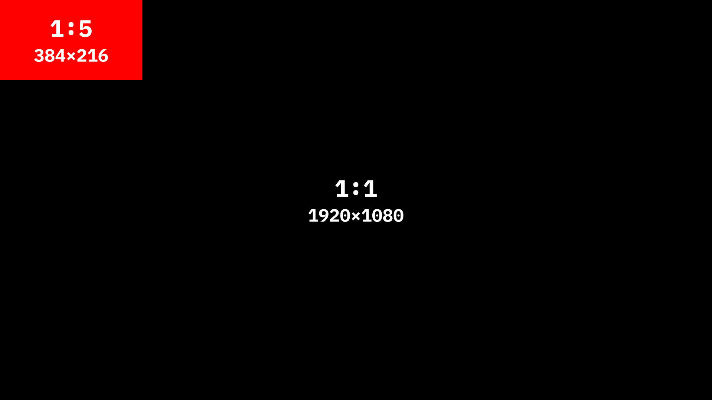
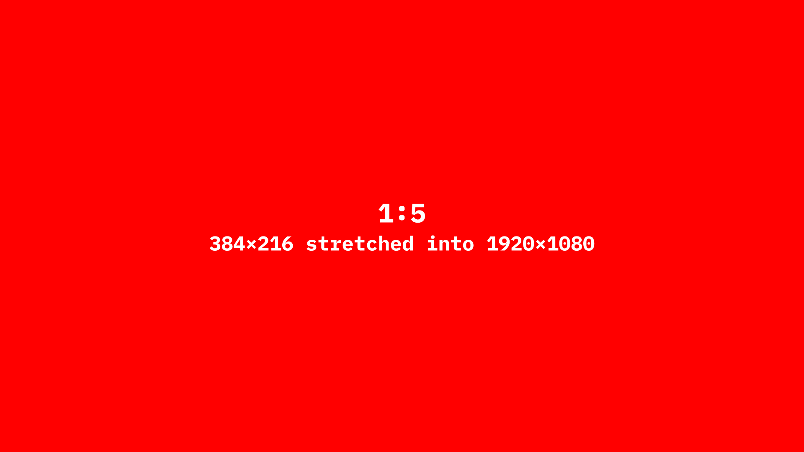

Codpen example: [https://codepen.io/editor/yet-3/pen/019d031c-ed4d-7466-b5d5-5e8c13b2a25f](https://codepen.io/editor/yet-3/pen/019d031c-ed4d-7466-b5d5-5e8c13b2a25f)

I've always enjoyed pixel-art, it has a certain charm that high resolution graphics don't have. I remember playing around in [Unity](https://unity.com/), and stumbling upon a tutorial on how to achieve a pixel-perfect look. So when I wanted to do something with `<Canvas>`, I thought that recreating that effect would be a good idea. And since I also wanted to give writing a try, this would make a decent first article.

In this article, I'd like to show how to accomplish a pixelation effect.

## How it works

1. First we draw whatever we want in a high-resolution
1. We disable anti-aliasing on the canvas
1. We take our canvas and draw it on itself as a scaled down image
1. We reset the scale
1. Finally we draw the canvas again but this time we stretch it to fill the entire canvas

We can still render things in high resolution, we simply have to do so after the last step of the pixelation. This can be useful for stuff like UI if you're making a game.

## Implementation

First we set-up our canvas

```js
const canvas = document.createElement("canvas");
document.body.append(canvas);

const ctx = canvas.getContext("2d");
canvas.width = 1920;
canvas.height = 1080;
```

Second we reset any transforms that might have been applied during drawing, we also have to disable image smoothing otherwise our drawings will be blurry.

```js
ctx.resetTransform();
ctx.imageSmoothingEnabled = false;
```

Then, we scale it down (for example by: `5`), the higher the scale the higher the pixelation effect (since we're scaling resolution here, assuming the base 1920x1080 will become 384 x 216). Next we draw our current canvas as an image

```js
ctx.scale(1 / SCALE, 1 / SCALE);
ctx.drawImage(canvas, 0, 0);
```


Then, we do the same thing again, but this time we scale it up by the same value as we scaled it down by (we used 5 earlier), basically we're resetting the scale.
The first time we drew the canvas it was drawn with its own dimensions (384x216), now we want to stretch it to cover the entire canvas area, so we multiply the canvas dimensions by our `SCALE`.

```js
ctx.scale(SCALE, SCALE); // we could also do ctx.resetTransform() here instead
ctx.drawImage(canvas, 0, 0, canvas.width * SCALE, canvas.height * SCALE);
```


And that's it, anything we draw before this code will be pixelated. If we want to then render something at higher resolution, we just re-enable image smoothing and draw afterward.

```js
ctx.imageSmoothingEnabled = true;
```

Full code

```js
const canvas = document.createElement("canvas");
document.body.append(canvas);

const ctx = canvas.getContext("2d");
canvas.width = 1920;
canvas.height = 1080;
const SCALE = 5;

// Here we draw what we want to be pixelated
ctx.fillStyle = "white";
ctx.translate(canvas.width / 2 - 125, canvas.height / 2);
ctx.rotate(Math.PI / 4);
ctx.fillRect(-50, -50, 100, 100);

// ====== Pixelation ======
ctx.resetTransform();
ctx.imageSmoothingEnabled = false;
ctx.scale(1 / SCALE, 1 / SCALE);
ctx.drawImage(canvas, 0, 0);
ctx.scale(SCALE, SCALE);
ctx.drawImage(canvas, 0, 0, canvas.width * SCALE, canvas.height * SCALE);
ctx.imageSmoothingEnabled = true;
// ========================

// Here we draw what we want to be high-res
ctx.fillStyle = "white";
ctx.translate(canvas.width / 2 + 125, canvas.height / 2);
ctx.rotate(Math.PI / 4);
ctx.fillRect(-50, -50, 100, 100);
```

Here's what we should get


## Summary

I think this is one of those effects that looks more complicated than it actually is. It takes only a couple lines of code but can be quite stylistically powerful whether you're working on a pixel-art game or a retro looking project.
